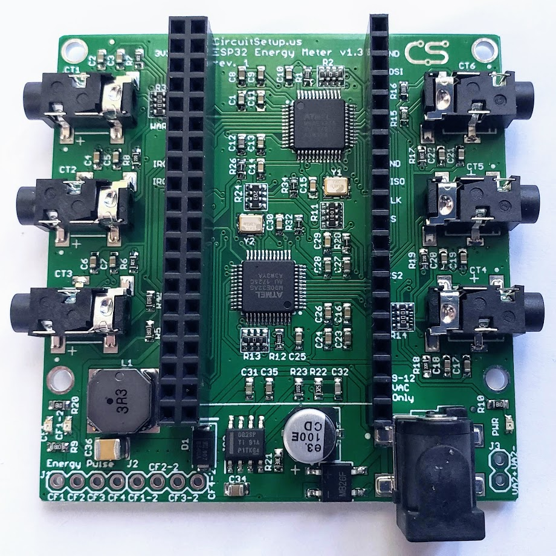
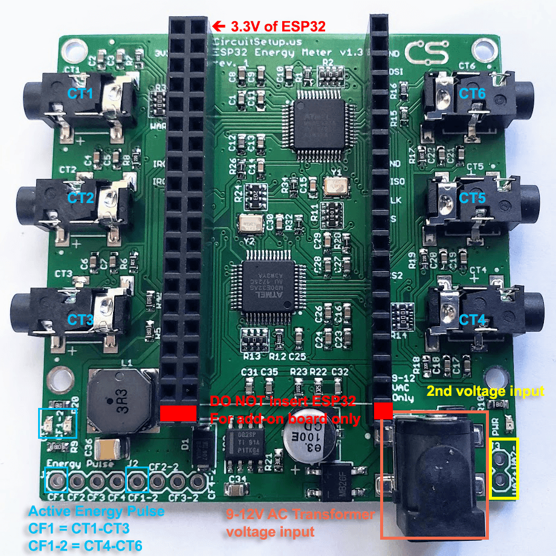
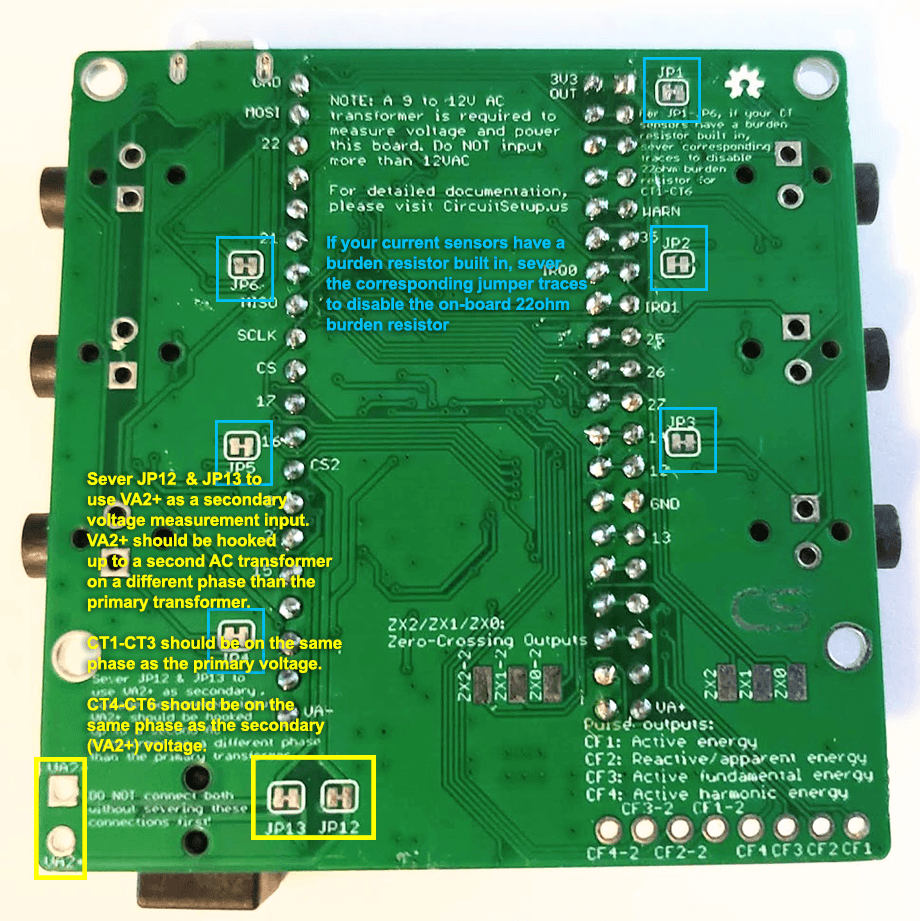
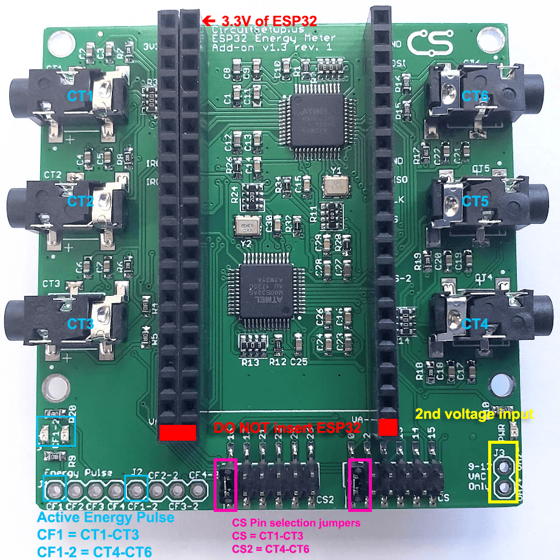
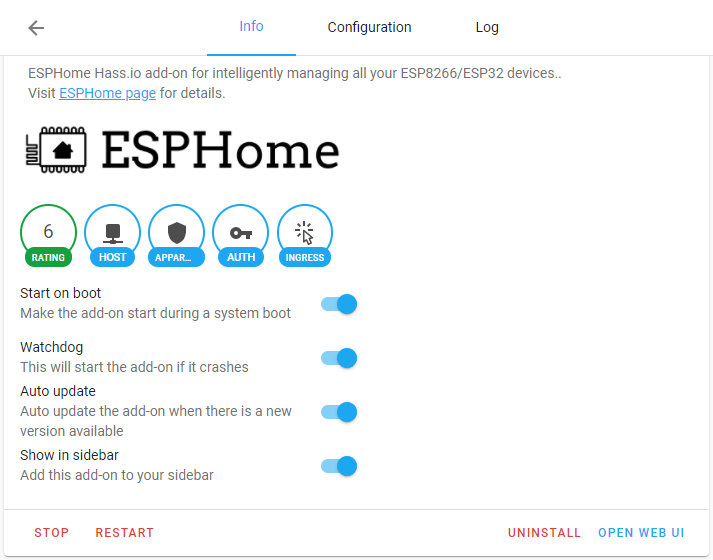
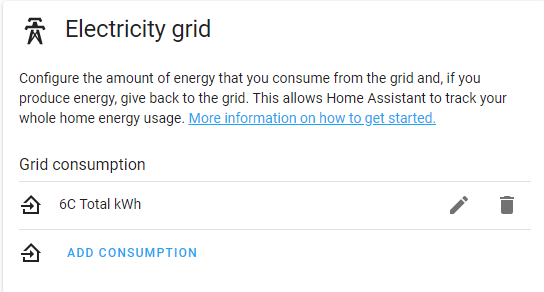

# CircuitSetup Expandable 6 Channel ESP32 Energy Meter

The CircuitSetup Expandable 6 Channel ESP32 Energy Meter is a real-time power and energy monitor built around two ATM90E32AS metering ICs. The main board measures six current transformer channels and one voltage reference by default, and you can stack up to six add-on boards for a total of 42 current channels. It is a good fit for whole-home monitoring, subpanels, solar, large branch circuits, and multi-voltage or 3-phase projects.

The first AC-AC adapter powers the main board and provides the primary voltage reference. A second voltage can be measured on the main board, and stacked systems can monitor additional voltage references when the hardware is configured for it.

## Typical Uses

- North American split-phase 120V/240V 60Hz service: mains, solar, subpanels, and individual circuits
- Single-phase 230V/240V 50Hz or 60Hz systems with a suitable 9VAC or 12VAC AC-AC adapter
- 3-phase systems when each measured phase has the correct voltage reference

## Features

- 6 current channels on the main board
- Expandable to 42 current channels and up to 8 voltage references with add-on boards
- Built around two ATM90E32AS energy metering ICs
- Calculates active power, reactive power, apparent power, power factor, frequency, and temperature
- 16-bit measurement resolution
- 22 ohm burden resistors on each current channel
- Built-in buck converter to power the board and supported ESP32 dev boards
- SPI interface to the ESP32
- Energy pulse outputs, IRQ outputs, warning output, and zero-crossing signals are available on the board
- Typical metering IC accuracy is 0.1 percent with a 6000:1 dynamic range
- Current gain selection is available up to 4x

## What You Will Need

### Current Transformers

You can use any mix of supported CTs as long as the secondary output does not exceed 720mV RMS or 33mA. CircuitSetup CTs with mA output work directly with the board and do not require cutting the burden resistor jumpers on the back.

- [SCT-006 20A/25mA Micro CT](https://circuitsetup.us/product/20a-25ma-micro-current-transformer-yhdc-sct-006-6mm/) - 6mm opening, 3.5mm plug
- [SCT-010 80A/26.6mA Mini CT](https://circuitsetup.us/product/80a-26-6ma-mini-current-transformer-yhdc-sct-010-10mm/) - 10mm opening, 3.5mm plug
- [SCT-013-000 100A/50mA CT](https://circuitsetup.us/product/100a-50ma-current-transformer-yhdc-sct-013/) - 13mm opening, 3.5mm plug
- [SCT-016 120A/40mA CT](https://circuitsetup.us/product/120a-40ma-current-transformer-yhdc-sct-016-with-3-5mm-jack-16mm-opening/) - 16mm opening, 3.5mm plug
- [SCT-024 200A/50mA CT](https://circuitsetup.us/product/200a-50ma-current-transformer-yhdc-sct-024-24mm/) - 24mm opening, 3.5mm plug
- Magnelab SCT-0750-100 and similar voltage-output CTs can also be used, but channels using CTs with built-in burden resistors require the matching jumper trace on the back of the board to be cut

### AC-AC Transformer

The meter requires an AC output transformer, not a DC wall adapter.

- North America: [Jameco Reliapro 120V to 9VAC](https://circuitsetup.us/product/jameco-ac-to-ac-wall-adapter-transformer-9-volt-1000ma-black-straight-2-5mm-female-plug/) or a similar 9VAC or 12VAC adapter with a 2.5mm center pin
- Europe and other 230V regions: use a native 230V to 9VAC or 12VAC AC-AC adapter rated for at least 500mA. [OpenEnergyMonitor keeps a useful list here](https://learn.openenergymonitor.org/electricity-monitoring/voltage-sensing/different-acac-power-adapters)

### ESP32

Supported and documented controller options:

- [NodeMCU 32s](https://circuitsetup.us/product/nodemcu-32s-esp32-esp-wroom-32-development-board/)
- Espressif ESP32-DevKitC-32E
- Espressif ESP32-DevKitC-VIE
- Boards with the same 19-pin-per-side pinout as the boards above
- Ethernet options for ESPHome only: [CircuitSetup ESP32-S3 Ethernet Adapter](https://circuitsetup.us/product/6-channel-energy-meter-ethernet-adapter/), [LilyGO T-ETH-Lite ESP32-S3](https://www.lilygo.cc/products/t-eth-lite?variant=43120880779445), or [Waveshare ESP32-S3 ETH](https://www.waveshare.com/esp32-s3-eth.htm?sku=28972)

Boards with different pin maps are not drop-in compatible just because they are "ESP32" boards. For example, ESP32-C6 dev boards use different pins and are not part of the documented support path for this repo.
If you are comparing boards visually, the documented dev boards are usually 19 pins per side, with `3V3` at the upper-left corner and `CLK` at the lower-right corner when installed correctly.

### Software

- [ESPHome](https://esphome.io/components/sensor/atm90e32/) and [Home Assistant](https://www.home-assistant.io/integrations/esphome/) - recommended for most new installs
- [EmonESP](Software/EmonESP/readme.md) and [EmonCMS](https://emoncms.org/) - good if you want EmonCMS or MQTT without Home Assistant
- [CircuitPython library](https://github.com/BitKnitting/CircuitSetup_CircuitPython)
- [MicroPython library](https://github.com/BitKnitting/CircuitSetup_micropython)

## Setting Up the Meter




### Plugging In the ESP32

The board is designed so the ESP32 dev board plugs directly into the meter.

Always insert the ESP32 with `3V3` in the upper-left corner of the meter. The lower pins are used to pass the voltage reference to add-on boards. Plugging the ESP32 into the lower row will likely short the board.

### Main Board SPI and Chip-Select Pins

The meter communicates with the ESP32 over SPI.

Main board SPI pins:

- `CLK` - GPIO18
- `MISO` - GPIO19
- `MOSI` - GPIO23
- `CS1` - GPIO5 for CT1-CT3 and Voltage 1
- `CS2` - GPIO4 for CT4-CT6 and Voltage 2

The 6-channel version of EmonESP in this repo is already set up with the main board pin defaults. Current ESPHome configs for the main board and add-on boards are in [Software/ESPHome](Software/ESPHome).

### Add-On Boards

Each add-on board adds six more CT channels. Up to six add-on boards can be stacked on the main board.

Each add-on board has two CS jumper banks:

- `CS` for CT1-CT3 on that add-on board
- `CS2` for CT4-CT6 on that add-on board

Only choose one pin per bank. The default jumper positions used by the installer and repo configs are:

| Add-on board | `CS` for CT1-CT3 | `CS2` for CT4-CT6 |
| --- | --- | --- |
| 1st add-on | GPIO0 | GPIO16 |
| 2nd add-on | GPIO27 | GPIO17 |
| 3rd add-on | GPIO2 | GPIO21 |
| 4th add-on | GPIO13 | GPIO22 |
| 5th add-on | GPIO14 | GPIO25 |
| 6th add-on | GPIO15 | GPIO26 |

GPIO2 can interfere with programming on some ESP32 boards. If you temporarily cannot flash the ESP32 while that jumper is connected, disconnect that add-on board or move the jumper while programming, then restore the expected setting.

If you change jumper positions from the defaults, update the matching `cs_pin` values in your ESPHome config. See [Software/ESPHome/README.md](Software/ESPHome/README.md) for examples.



### CT Compatibility, Burden Resistors, and `JP1-JP6`

Each current channel on the board has an onboard burden resistor. That is correct for CircuitSetup CTs with mA output.

Only cut the matching rear jumper trace for a CT channel if that CT already has its own burden resistor, which is usually the case for voltage-output CTs such as 1V-output models.

In practice:

- CircuitSetup SCT-006, SCT-010, SCT-013-000, SCT-016, and SCT-024 CTs do not require cutting `JP1-JP6`
- 1V-output CTs such as SCT-013-030 or SCT-013-050 do require cutting the matching jumper trace for the channel they are connected to
- If you are mixing CT types, only cut the jumper traces for the specific channels using CTs with built-in burden resistors

### Common Calibration Starting Values

Each current channel can use its own calibration value. In the current ESPHome configs that means setting `current_cal_ct1`, `current_cal_ct2`, and so on for the main board, plus the add-on board calibration variables where needed.

Common starting values:

| Sensor | Calibration value |
| --- | --- |
| SCT-006 20A/25mA | `11143` |
| SCT-013-030 30A/1V | `8650` |
| SCT-013-050 50A/1V | `15420` |
| SCT-010 50A/16.6mA | `41334` |
| SCT-010 80A/26.6mA | `41660` |
| SCT-013-000 100A/50mA | `27518` |
| SCT-016 120A/40mA | `41787` |
| SCT-024 200A/100mA | `27518` |
| SCT-024 200A/50mA | `55036` |
| Jameco 9VAC transformer | `7305` |

These are good starting points, not guaranteed final values. If you want tighter accuracy, use the ESPHome semi-automatic calibration workflow described below.

### Measuring More Than 65A on One Channel

The ATM90E32 current register tops out at `65.535A` before scaling. If you expect to measure more than that on one channel, divide the CT calibration value and multiply the reported current and power in software. Current examples are already documented in [Software/ESPHome/README.md](Software/ESPHome/README.md) and shown in [Software/ESPHome/6chan_energy_meter_main_board.yaml](Software/ESPHome/6chan_energy_meter_main_board.yaml).

For 200A service this usually means you are monitoring a larger CT but scaling it in software so the meter stays within range.

### Power Calculations and Board Revisions

The board uses voltage references to calculate power, power factor, and the other metering values.

- v1.1 used one voltage channel per ATM90E32 by default, so some power calculations had to be done in software unless registers were remapped
- v1.2 and v1.3 added `JP8-JP11` so voltage channels could be tied together. Most v1.3 boards shipped with those connections already joined
- v1.4 and later removed `JP8-JP11` and route those voltage channels internally on the PCB

### Measuring Dual-Pole 240V Circuits on Split-Phase Service

For split-phase systems, a 240V load has two hot legs. There are three practical ways to measure it:

1. Measure one hot leg with one CT and double the current and power in software. This uses the fewest channels but is the least accurate.
2. Measure each hot leg with its own CT. This is the most flexible option.
3. If the wiring layout allows it and the CT opening is large enough, pass both hot legs through a single CT in opposite directions.

If a CT is not in phase with its voltage reference, current and power will read negative. On split-phase systems that usually means the CT is flipped around the wrong conductor.

### Measuring a Second Voltage

The `VA2` pads next to the power jack on the main board, and the `VA2` pads on add-on boards, let you measure a second voltage reference.

To do that:

1. Cut `JP12` and `JP13` on v1.3 and newer boards, or `JP7` on older revisions
2. Use a second AC-AC transformer, ideally the same model as the primary one
3. Connect that second transformer to the opposite phase you want to reference
4. Add a suitable connector or pigtail to the `VA2+` and `VA2-` pads

When those voltage jumpers are cut:

- CT1-CT3 stay referenced to the primary voltage
- CT4-CT6 use the `VA2` voltage reference

That means CT4-CT6 should measure circuits on the same phase as `VA2`, or the CT direction must be reversed so the current is in phase with the voltage reference.

On add-on boards, the primary voltage normally comes from the main board. If you wire a separate `VA2` voltage reference on an add-on board, that secondary voltage is used for CT4-CT6 on that add-on board.

### Measuring 3-Phase Power

For accurate 3-phase power metering you need a matching voltage reference for each measured phase.

The cleanest 3-phase setup is:

- one main board, v1.4 or newer
- one add-on board
- three AC-AC transformers, one per phase
- headers or connectors installed on the `VA2` pads as needed
- `JP12` and `JP13` cut on the boards where separate voltage references are being used

The first transformer connected to the main board also powers the electronics and ESP32, so it should provide at least 500mA.

With that hardware:

- main board CT1-CT3 can reference phase 1
- main board CT4-CT6 can reference phase 2
- add-on board CT1-CT6 can reference phase 3, depending on how you feed voltage to that board

An alternate 3-phase approach is to use two add-on boards and feed a separate transformer into each add-on board. In that setup, the bottom `VA-` and `VA+` feed from the main board is no longer used for those add-ons, and you wire the new transformer to the `VA2` pads on each add-on instead.

If a CT is tied to a different phase than its voltage reference, active power and power factor will be wrong even if current itself looks reasonable.

## Software Options

### ESPHome and Home Assistant

ESPHome is the recommended path for most new installs. It integrates cleanly with Home Assistant, supports Wi-Fi or Ethernet, uses the live CircuitSetup ESP Web Installer, and the repo already includes maintained YAML packages for the main board and every add-on count.

If you are using Home Assistant, start by installing ESPHome Device Builder. The official getting-started guide is here:

- [Getting Started with ESPHome and Home Assistant](https://esphome.io/guides/getting_started_hassio/)

The current Home Assistant add-on install flow is:

1. Open `Settings > Add-ons > Add-on Store`
2. Search for `ESPHome Device Builder`
3. Install it, then click `Start`
4. Click `Open Web UI`



### Flashing With the CircuitSetup ESP Web Installer

The easiest way to get started is the live installer:

- [CircuitSetup ESP Web Installer](https://circuitsetup.github.io/ESPWebInstaller/)

Current installer flow for the 6 Channel Meter:

1. Choose the number of add-on boards, from `None` to `6`
2. Choose the connection type:
   - `Wi-Fi`
   - `Ethernet (Lilygo)`
   - `Ethernet (Waveshare)`
3. Choose the firmware version
4. Connect the ESP32 to your computer with a USB data cable
5. Click `Connect`, pick the correct serial port, and install the firmware
6. If the board does not enter the bootloader automatically, hold the right or `IO0` button while starting the install

### What the Default ESPHome Config Already Includes

The current repo configs are built for the current ESPHome workflow, not the older legacy setup:

- `dashboard_import` so the device can be adopted into ESPHome Device Builder
- `name_add_mac_suffix: true` so multiple identical meters do not collide on the network
- `ota: - platform: esphome` for current OTA updates
- `captive_portal`, `esp32_improv`, and `improv_serial` on Wi-Fi builds for provisioning
- `time: - platform: homeassistant` in the shared packages used by the standard configs

After the first flash:

- Wi-Fi builds can be provisioned from the browser, via Improv, or through the fallback captive portal if the device is not yet on your network
- Ethernet builds come up on your wired network once flashed and connected
- The device should appear in ESPHome Device Builder and in Home Assistant under `Settings > Devices & services`
- You can edit the imported YAML inside ESPHome Device Builder, or copy the files locally from [Software/ESPHome](Software/ESPHome) if you prefer to manage everything yourself

If you want the maintained package-based configs, start from the files in [Software/ESPHome](Software/ESPHome). If you want more control, use [Software/ESPHome/README.md](Software/ESPHome/README.md) as the advanced reference for package layout, calibration files, CS-pin changes, and example configs.

### ESPHome Calibration

Default calibration values are usually good enough to get started, but ESPHome now makes calibration much easier than the older manual-only flow.

The configs in this repo include optional semi-automatic calibration controls that let you:

- enter known current and voltage references
- calculate gain values
- calculate offset values when you see non-zero readings at no load
- copy the calculated values from the logs back into your YAML

Useful references:

- [ESPHome ATM90E32 calibration docs](https://esphome.io/components/sensor/atm90e32/#calibration)
- [Software/ESPHome/README.md](Software/ESPHome/README.md)

### Home Assistant Energy Dashboard



The current repo configs already use the right Home Assistant time source and current energy-sensor metadata. If you are building your own sensors, use the same pattern as the current configs:

```yaml
sensor:
  - platform: total_daily_energy
    name: ${friendly_name} Total kWh
    power_id: totalWattsMain
    filters:
      - multiply: 0.001
    unit_of_measurement: kWh
    device_class: energy
    state_class: total_increasing
```

If you are using the standard package configs in this repo, `time: - platform: homeassistant` is already included and does not need to be added again.

Helpful example configs:

- Main board only: [Software/ESPHome/6chan_energy_meter_main_board.yaml](Software/ESPHome/6chan_energy_meter_main_board.yaml)
- Solar plus house example: [Software/ESPHome/examples/6chan_energy_meter_house_solar_ha_kwh.yaml](Software/ESPHome/examples/6chan_energy_meter_house_solar_ha_kwh.yaml)
- 3-phase example: [Software/ESPHome/examples/6chan_energy_meter_3-phase_ethernet.yaml](Software/ESPHome/examples/6chan_energy_meter_3-phase_ethernet.yaml)

In Home Assistant:

1. Open `Settings > Energy`
2. Add your total import sensor under the electricity grid section
3. Add return-to-grid and solar production sensors if you are tracking export or generation
4. Add per-circuit energy sensors if you want individual device or branch circuit tracking

### Optional: InfluxDB and Grafana

If you want long-term storage outside the default Home Assistant recorder, the easiest path is to expose the meter data to Home Assistant first and then use the Home Assistant InfluxDB integration.

- [Home Assistant InfluxDB integration](https://www.home-assistant.io/integrations/influxdb/)

### EmonESP and EmonCMS

EmonESP is still a good option if your main goal is sending data to a local EmonCMS install, [emoncms.org](https://emoncms.org/), or MQTT without making Home Assistant the center of the system.

The 6-channel EmonESP files in this repo already include the correct pin defaults for the main board and support calibration changes from the web UI.

Key points:

- You must use an ESP32
- You can build it with Arduino IDE or PlatformIO
- It requires the [CircuitSetup ATM90E32 Arduino library](https://github.com/CircuitSetup/ATM90E32)
- The 6-channel-specific notes are in [Software/EmonESP/readme.md](Software/EmonESP/readme.md)
- The broader EmonESP setup flow is documented here: [Split Single Phase EmonESP setup](https://github.com/CircuitSetup/Split-Single-Phase-Energy-Meter/tree/master/Software/EmonESP)

If you need separate voltage calibration for a specific add-on-board voltage channel in EmonESP, note the local EmonESP readme: by default the add-on voltage channel uses the main board calibration unless you define a separate variable in `energy_meter.cpp`.

### CircuitPython and MicroPython

If you want to build your own application stack instead of using ESPHome or EmonESP, these community libraries are available:

- [CircuitSetup CircuitPython library](https://github.com/BitKnitting/CircuitSetup_CircuitPython)
- [CircuitSetup MicroPython library](https://github.com/BitKnitting/CircuitSetup_micropython)

## FAQ

**Q: One CT is reading low, or not reading at all. What should I check first?**

**A:** First make sure the CT plug is fully seated. The jacks can be tight, and the connector often needs to be pushed in until it clicks. If one channel still reads low after that, swap CTs between channels to find out whether the issue follows the CT or stays with the board jack.

**Q: Does the 6-channel meter work outside North America?**

**A:** Yes. Set the line frequency for your system and use the correct AC-AC transformer for your mains voltage. For 230V or 240V systems, use a native 230V to 9VAC or 12VAC adapter when possible instead of a step-down transformer plus a US wall adapter.

**Q: Can I use a 230V to 120V step-down transformer with a US 9VAC adapter?**

**A:** It can work, but it is not the preferred setup. A native 230V to 9VAC or 12VAC AC-AC adapter is simpler, cleaner, and usually the better long-term choice. If you do use a different adapter, plan to calibrate the voltage.

**Q: I am getting a negative value on one current channel. What is happening?**

**A:** The CT is usually backwards on the conductor. Turn the CT around. If every CT is negative, the AC transformer phase is probably reversed.

**Q: I see a small negative value at no load, but positive values under load. Is that normal?**

**A:** That is usually offset error, not a wiring failure. Run the voltage and current offset calibration in ESPHome if you want the cleanest fix. If you just need to clamp small negative values to zero in a template, that is also possible, but offset calibration is the better solution.

**Q: Can I extend the CT wires?**

**A:** Yes. A short 3.5mm extension cable or a clean custom extension usually works fine. After adding a longer run, recalibrate if you want the best accuracy.

**Q: Can I use other CTs with this meter?**

**A:** Usually yes, as long as the CT secondary output stays within the supported range. The important limits are the CT output, not the brand name. If the CT has a built-in burden resistor or a voltage output such as 1V, cut the matching jumper trace on the board for that channel.

**Q: Can I use SCT-024 200A CTs on the 6-channel meter?**

**A:** Yes, but you still need to respect the meter input range. With the newer 200A/50mA SCT-024, the practical maximum current you should measure directly without additional scaling is about 132A on one channel. If you need to monitor more than that, use the software scaling approach described above.

**Q: How do I know whether to cut `JP1-JP6`?**

**A:** Leave the jumper trace intact for mA-output CTs such as CircuitSetup SCT-006, SCT-010, SCT-013-000, SCT-016, and SCT-024. Cut the matching jumper trace only for channels using CTs with built-in burden resistors, which usually means voltage-output CTs such as 1V models.

**Q: Do CTs need mono 3.5mm plugs, or will stereo plugs work?**

**A:** The board uses the CT signal on the tip and sleeve. A CT with a stereo 3.5mm plug usually works fine as long as the CT output is wired correctly and the electrical output itself is compatible. The plug style matters less than the CT secondary type and wiring.

**Q: Can I mix different CT types on one meter?**

**A:** Yes. That is a common setup. Give each current channel the correct calibration value for the CT on that channel. Do not assume the same calibration applies to every CT just because they are on the same board.

**Q: My add-on board shows `NA`, or I see `connection to ATM90E32 failed`. What should I check?**

**A:** Start with the basics:

- confirm you flashed the firmware for the correct add-on count
- confirm the add-on board jumper positions match the expected CS pair for that stack position
- confirm the add-on board is fully seated
- if you changed jumper positions, confirm the matching `cs_pin` values were also changed in ESPHome

If the main board works by itself and both boards stop reporting as soon as the add-on is installed, the jumper selection or physical seating is usually the first thing to verify.

**Q: Which ESP32 dev boards are supported?**

**A:** Use a NodeMCU 32s, an ESP32-DevKitC-32E, an ESP32-DevKitC-VIE, or another board with the same pinout. Ethernet is supported with the documented LilyGO or Waveshare ESP32-S3 options plus the proper adapter and matching YAML. Boards with different pin maps, including ESP32-C6 dev boards, are not documented drop-in replacements for this repo.

**Q: Can I connect the meter to Ethernet?**

**A:** Yes, with the documented ESPHome Ethernet options. Start with:

- [Software/ESPHome/6chan_energy_meter_main_ethernet.yaml](Software/ESPHome/6chan_energy_meter_main_ethernet.yaml)
- [Software/ESPHome/6chan_energy_meter_main_ethernet_waveshare.yaml](Software/ESPHome/6chan_energy_meter_main_ethernet_waveshare.yaml)

Use the matching firmware in the web installer for `Ethernet (Lilygo)` or `Ethernet (Waveshare)`.

**Q: How do I set up solar and return-to-grid tracking?**

**A:** Use separate power calculations for house import, solar generation, and return-to-grid export. The best starting point is the maintained example here:

- [Software/ESPHome/examples/6chan_energy_meter_house_solar_ha_kwh.yaml](Software/ESPHome/examples/6chan_energy_meter_house_solar_ha_kwh.yaml)

**Q: How can I do calculations across two different meters in Home Assistant?**

**A:** Create a template helper or template sensor in Home Assistant and do the math there. Use each meter's total power or energy sensor as inputs, then expose the calculated sensor back to the Energy dashboard if needed.

**Q: My older ESPHome config no longer compiles after updating ESPHome. What is the easiest fix?**

**A:** The repo has moved forward with the current ESPHome workflow, including `esp-idf`, `dashboard_import`, current OTA syntax, and the maintained package structure in [Software/ESPHome](Software/ESPHome). The fastest path is usually to start from the current repo config or reflash with the [CircuitSetup ESP Web Installer](https://circuitsetup.github.io/ESPWebInstaller/) and then merge your custom names and calibration values back in.

## More Resources

- [CircuitSetup ESP Web Installer](https://circuitsetup.github.io/ESPWebInstaller/)
- [ESPHome ATM90E32 docs](https://esphome.io/components/sensor/atm90e32/)
- [Getting Started with ESPHome and Home Assistant](https://esphome.io/guides/getting_started_hassio/)
- [Home Assistant ESPHome integration](https://www.home-assistant.io/integrations/esphome/)
- [Home Assistant Energy docs](https://www.home-assistant.io/docs/energy/)
- [Software/ESPHome/README.md](Software/ESPHome/README.md)
- [Software/EmonESP/readme.md](Software/EmonESP/readme.md)
- [Digiblur video on calibration and ESPHome setup](https://www.youtube.com/watch?v=BOgy6QbfeZk)
- [DIY Home Power and Solar Energy Dashboard with Home Assistant and ESPHome](https://www.youtube.com/watch?v=n2XZzciz0s4)
- [TH3D video with add-on board setup](https://www.youtube.com/watch?v=zfB4znO6_Z0)
